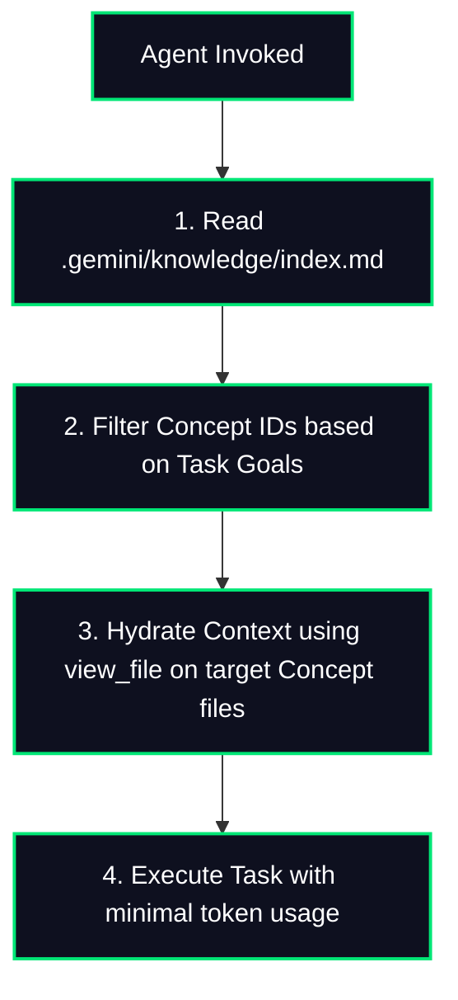

> [!IMPORTANT]
> **DISCLAIMER & LIABILITY NOTICE**: This is a **personal, individual project** created and maintained entirely by the author (Prashanth). It is **not** an official Google product, it is **not** affiliated with or supported by Google Cloud or Google LLC, and it does **not** come with any official support or warranty. By using this software, you acknowledge that you are solely liable for its use.

# 📚 Google Open Knowledge Format (OKF) - Knowledge Catalog

[](https://skills.sh)


An advanced custom skill defining the authoritative structure, schema validation, and progressive disclosure standards for managing a **Google Open Knowledge Format (OKF)** Knowledge Bundle. 

By structuring agent-generated findings, telemetry, threat models, and playbooks as standard human-readable Markdown concepts, OKF solves the context-assembly problem—making workspace knowledge modular, portable, and easily queryable by both human developers and downstream agentic assistants.

---

## 📂 The OKF Bundle Directory Structure

An OKF bundle resides inside `.gemini/knowledge/` and partitions project knowledge across modular stages:

| Directory / File | Type | Purpose | Schema / Key Concepts |
| :--- | :--- | :--- | :--- |
| `index.md` | **Index** | Table of Contents & progressive disclosure router. | Automatically rebuilt dynamically. |
| `log.md` | **Changelog** | Chronological record of knowledge catalog updates. | Change-driven tracking. |
| `scout/` | **Reference** | Ingested repository structure, environment details, APIs. | `codebase_map.md`, `web_intel.md` |
| `analyst/` | **Scenario** | Behavior-Driven Development (BDD) files, user preferences. | `user_decisions.md`, `bdd_scenarios.md` |
| `architecture/`| **Contract** | System design specs, database schemas, Pydantic data contracts. | `data_contracts.md`, `blueprints.md` |
| `builder/` | **Playbook** | Local setup guides, integration procedures, runbooks. | `local_setup_runbook.md` |
| `sentry/` | **Audit** | Security threat models, compliance reports, verification logs. | `threat_model.md`, `evidence_audit.md` |
| `mentor/` | **Pedagogy** | Educational design-pattern files and sandboxed exercises. | `solid_design_patterns.md` |

---

## 🔄 Progressive Disclosure & Context Retrieval

To avoid prompt-token bloat and optimize context cache-hits on Google Gemini models, this skill enforces a structured **Retrieval-Augmented Generation (RAG)** loop:



---

## 🛠️ Installation & Usage

Install this skill into your agent environment using `npx skills`:

```bash
npx skills add ksprashu/skills-knowledge-catalog
```

### Manual Workspace Execution
Once installed, you can trigger the cataloging skill inside any Antigravity-equipped terminal or chat:

> *"Please catalog this project using our knowledge-catalog skill."*

The agent will discover key files, initialize the `.gemini/knowledge/` directory, write standard YAML-frontmatter Concept files, and compile the interactive progressive index.

---

## 📝 Concept Document Specification
Every concept document inside the catalog is a standard UTF-8 Markdown file decorated with strict metadata frontmatter:

```yaml
---
type: <Type name>                  # REQUIRED. (e.g., "Scenario", "Threat Model", "Playbook")
title: <Display name>              # Human-readable name.
description: <One-line summary>    # Short snippet used in index files.
resource: <Canonical URI>          # Unique URI referencing the physical codebase asset.
tags: [tag1, tag2]                 # Optional semantic taxonomy grouping tags.
---
# Concept Title
Detailed body text here...
```
